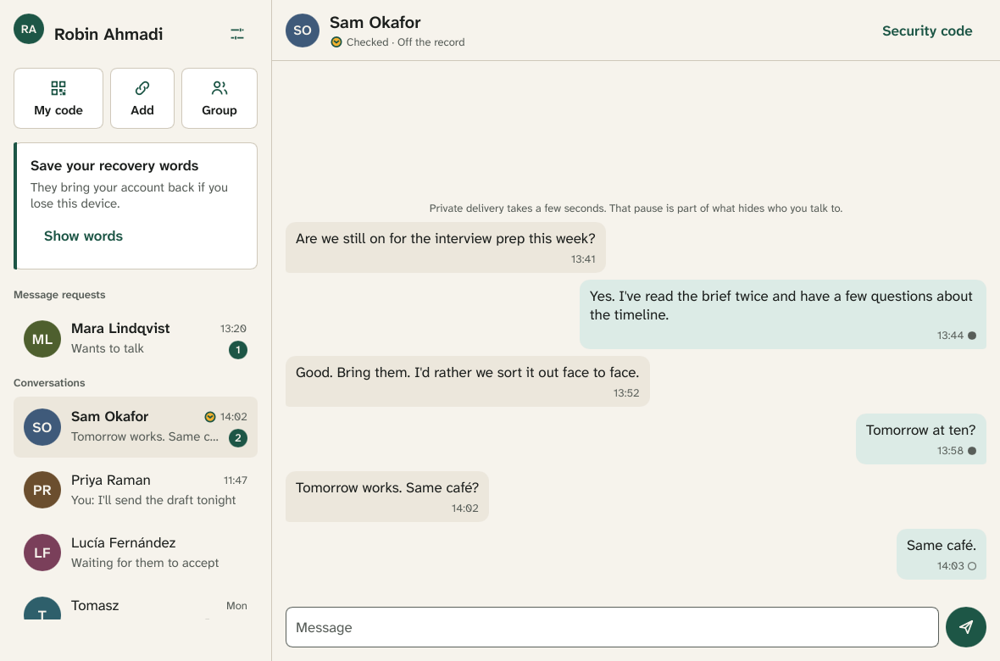

# Enclave

Enclave is an open-source messenger with the features people expect from
Signal (chats, groups, voice and video calls, photos, voice notes, reactions,
disappearing messages) and a much stronger design against surveillance:

* **Post-quantum from the first message.** Every session combines three
  independent key-exchange families (X448, ML-KEM-1024 and Classic
  McEliece-8192128), and every ratchet turn takes a full post-quantum step.
* **Metadata hidden, not just content.** Traffic goes through the Nym mixnet
  over Tor, every message is the same size, and cover traffic hides when you
  are talking. Servers never learn who writes to whom.
* **No phone number, no email.** Your account is a key. Usernames are optional
  and checked by public key-transparency logs with independent witnesses.
* **No trusted server.** Anyone can run one; none of them can read messages,
  see your contacts or change your keys without being caught.
* **Rust everywhere possible**, including the UI.

The full design is in [`docs/PLAN.md`](docs/PLAN.md). Specifications are in
[`docs/`](docs/).

## Status

Early development. Nothing here is ready to protect anyone yet.

| Milestone | Scope | State |
|---|---|---|
| M0 | Specifications, license, governance, CI | In progress |
| M1 | Cryptographic core (`enclave-crypto`, `enclave-wire`) | In progress |
| M2–M12 | Protocol, servers, networking, apps, groups, calls, audits | Planned |

See [`docs/roadmap.md`](docs/roadmap.md) for gates and exit criteria.

## Building

Requires Rust 1.94.1 (pinned in `rust-toolchain.toml`). The test suite also
uses the system OpenSSL as an independent reference implementation for Ed448
and X448; it is never linked into Enclave itself.

```
cargo test --workspace --release
cargo clippy --workspace --all-targets -- -D warnings
cargo xtask labels
```

## Cryptography at a glance

| Role | Primitive |
|---|---|
| Account root | SLH-DSA-SHAKE-256s |
| Device signatures | Ed448 + ML-DSA-87 (both must verify) |
| Key agreement | X448 + ML-KEM-1024 + Classic McEliece-8192128 |
| KDF / MAC | KMAC256 |
| Encryption | EnclaveSeal: XChaCha20 then AES-256-CTR, KMAC256 256-bit tag |
| Passwords | Argon2id |

Enclave invents no new ciphers. What is new is how proven primitives are
combined; every combination is designed to stay secure if any one of its
parts holds, and will be proven with formal tools and audited before 1.0.

## License

GPL-3.0-only, with the additional permissions in
[`legal/ADDITIONAL-PERMISSIONS.md`](legal/ADDITIONAL-PERMISSIONS.md) (app-store
distribution and linking with Slint). See [`CONTRIBUTING.md`](CONTRIBUTING.md)
for the sign-off every commit needs, and [`SECURITY.md`](SECURITY.md) to report
a vulnerability.

## Try the desktop app

```sh
cargo run --release -p enclave-app --bin enclave            # offline demo: local server and a demo contact
cargo run --release -p enclave-server -- 127.0.0.1:7443 --kt-pins /tmp/kt-pins   # or a dev server…
cargo run --release -p enclave-app --bin enclave -- --server 127.0.0.1:7443 --profile ~/.enclave-dev --kt-pins /tmp/kt-pins
```

In the demo, the demo contact has the username `@sam@demo.enclave`; choose
your own under Settings. `--kt-pins` is the file where the dev server writes
its key-transparency keys and witnesses, which the app pins to check lookups.
To add a second device to an account, start another profile against the same
server, choose "I already have Enclave", and paste its link code on the first
device under Settings → Your devices.


